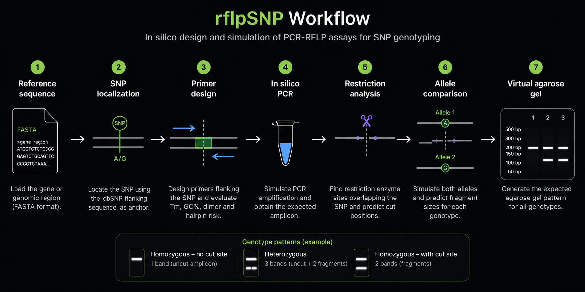

# `rflpSNP`

### In silico design and simulation of PCR-RFLP assays for SNP genotyping

> `rflpSNP` is an R package for designing and simulating PCR-RFLP assays for genotyping known SNPs, from a reference sequence and SNP flanking sequence through primer design, in-silico PCR, restriction-site analysis, and virtual agarose-gel prediction.

<!-- badges: start -->
[](https://github.com/Mike-EA/rflpSNP/actions/workflows/R-CMD-check.yaml)
[](https://opensource.org/licenses/MIT)
[](https://Mike-EA.github.io/rflpSNP/)
<!-- badges: end -->

---



## Overview

A **PCR-RFLP** (*Restriction Fragment Length Polymorphism*) assay can be used to determine the genotype of a known SNP without sequencing. The target region is amplified by PCR and then digested with a restriction enzyme whose recognition site is affected by the SNP.

Depending on the allele, the restriction site may be created or destroyed, producing different fragment patterns on an agarose gel.

| Genotype | Expected gel pattern |
|---|---|
| Homozygous without the cut site | 1 band — full, uncut amplicon |
| Heterozygous | 3 bands — full amplicon + 2 fragments |
| Homozygous with the cut site | 2 bands — the 2 fragments |

`rflpSNP` automates the **in-silico design and simulation of this workflow**, without requiring commercial software such as Primer3Plus or SnapGene.

> **Important:** `rflpSNP` produces candidate designs for computational evaluation. Experimental validation is still required. Primer candidates should be checked with a specialized tool such as IDT OligoAnalyzer before synthesis, and primer specificity should be independently verified.

---

## Features

- Locate a known SNP within a reference DNA sequence using a dbSNP flanking sequence.
- Define a working region around the SNP.
- Generate and filter forward/reverse primer candidates.
- Evaluate primer melting temperature (Tm) and GC content.
- Evaluate dimer and hairpin risk using heuristic criteria.
- Select and rank compatible primer pairs.
- Simulate PCR amplification in silico.
- Locate restriction-enzyme recognition sites in the amplicon.
- Simulate the alternate allele and compare restriction patterns.
- Generate amplicon and sequence maps.
- Simulate expected agarose-gel patterns.
- Export primer-design reports to text.
- Run the main PCR-RFLP workflow through a single pipeline function.

---

## Workflow

The package is designed around the following workflow:

```text
Reference FASTA
       │
       ▼
   Locate SNP
       │
       ▼
  Design primers
       │
       ▼
 Simulate PCR
       │
       ▼
Find restriction site
       │
       ▼
 Compare alleles
       │
       ▼
Predict fragments
       │
       ▼
Simulate agarose gel
```

The complete workflow can also be executed through `run_pcr_rflp_pipeline()` once the individual steps are understood.

---

## Installation

### Requirements

- **R** >= 4.1
- **RStudio** is recommended, especially for users who are new to R.

`rflpSNP` uses packages from both **CRAN** and **Bioconductor**.

### Install dependencies

Run the following once in the R console:

```r
# CRAN dependencies
install.packages(c("TmCalculator", "ggplot2", "devtools"))

# Bioconductor dependencies
if (!requireNamespace("BiocManager", quietly = TRUE)) {
  install.packages("BiocManager")
}

BiocManager::install(c("Biostrings", "S4Vectors"))
```

### Install `rflpSNP`

```r
devtools::install_github("Mike-EA/rflpSNP")
```

### Load the package

```r
library(rflpSNP)
```

### Verify the Tm backend

`TmCalculator`'s interface has changed across versions. `rflpSNP` includes a diagnostic function:

```r
check_tm_backend()
```

A successful installation should report:

```text
[OK] calc_tm() is working correctly; test Tm = ...
```

If a `[DIAGNOSTIC]` message appears, the output can be used to determine whether the installed `TmCalculator` version uses a renamed argument.

---

## Quick start

The main workflow can be run step by step or through the complete pipeline.

### 1. Load the reference sequence

```r
gene_seq <- read_gene_fasta("MTHFR_completeseq.fa")
```

### 2. Locate the SNP

The SNP is located using its flanking sequence:

```r
snp <- locate_snp(
  gene_seq,
  flank_seq = "GAAAAGCTGCGTGATGATGAAATCG"
)

snp$snp_pos
snp$snp_base
snp$strand
```

### 3. Design primers

```r
design <- design_primers(
  gene_seq,
  snp_pos = snp$snp_pos
)
```

The resulting object contains the best primer pairs and their relevant characteristics:

```r
design
design$top
design$best_pair
design$n_pairs_total
```

### 4. Simulate PCR

```r
bp <- design$best_pair

pcr <- simulate_pcr(
  gene_seq,
  fwd_primer = bp$forward_seq,
  rev_primer = bp$reverse_seq
)
```

### 5. Find the restriction site

For the example using *HinfI*:

```r
site <- find_restriction_site(
  pcr,
  enzyme_motif = "GANTC",
  cut_offset = 1
)
```

### 6. Simulate the complete PCR-RFLP workflow

Once the individual steps are understood:

```r
result <- run_pcr_rflp_pipeline(
  gene_seq,
  flank_seq = "GAAAAGCTGCGTGATGATGAAATCG",
  enzyme_motif = "GANTC",
  cut_offset = 1
)

result$snp
result$design
result$pcr_result
result$restriction_result
```

---

## Example: MTHFR C677T

The example used throughout the current user guide is the **MTHFR C677T SNP (rs1801133)** with the restriction enzyme **HinfI**.

A successful primer-design run can produce a result similar to:

```text
=== Best primer pair selected ===

Forward: TGGTCTCTTCATCCCTCGCCTTGAA
Reverse: GTCAGCCTCAAAGAAAAGCTGCGTG

Expected amplicon: 184 bp
Estimated RFLP fragments: 146 + 38 bp
```

The selected design stores information such as:

| Output | Description |
|---|---|
| `forward_seq`, `reverse_seq` | Primer sequences, 5' → 3' |
| `forward_tm`, `reverse_tm` | Primer melting temperatures |
| `forward_gc`, `reverse_gc` | GC content |
| `amplicon_bp` | Expected amplicon size |
| `tm_diff` | Tm difference between primers |
| `heterodimer_dg` | Heuristic heterodimer risk |
| `fragment_1`, `fragment_2` | Estimated digestion fragments |
| `score` | Internal ranking index |
| `recommended` | Identifies the recommended pair |

---

## Visualization

`rflpSNP` can generate visual representations of the predicted assay.

### Amplicon map

```r
map <- plot_amplicon_map(
  pcr,
  bp$forward_seq,
  bp$reverse_seq,
  site,
  enzyme_name = "HinfI"
)
```

### Sequence map

```r
plot_sequence_map(
  pcr,
  site,
  enzyme_name = "HinfI"
)
```

### Virtual agarose gel

```r
simulate_gel(
  amplicon_size = pcr$size,
  fragment_sizes = c(146, 38),
  genotype_labels = c(
    "Homozygous C/C",
    "Heterozygous C/T",
    "Homozygous T/T"
  )
)
```

The resulting plots are `ggplot` objects and can be saved with `ggplot2::ggsave()`.

---

## Primer-design parameters

`design_primers()` provides adjustable criteria for controlling the search.

| Parameter | Default | What it controls |
|---|---:|---|
| `upstream`, `downstream` | `160`, `200` | Size of the search region around the SNP |
| `length_min`, `length_max` | `18`, `24` | Primer length in bp |
| `tm_min`, `tm_max` | `50`, `65` | Acceptable Tm range |
| `gc_min`, `gc_max` | `35`, `65` | Acceptable GC-content range |
| `tm_diff_max` | `5` | Maximum Tm difference |
| `amplicon_min`, `amplicon_max` | `150`, `300` | Acceptable amplicon size |
| `min_fragment_diff` | `25` | Minimum difference between cut fragments |
| `max_small_fragment` | `100` | Maximum size of the smaller fragment |
| `min_fragment_size` | `40` | Minimum size of the smaller fragment |
| `n_top` | `5` | Number of top primer pairs reported |

For example:

```r
design <- design_primers(
  gene_seq,
  snp_pos = snp$snp_pos,
  amplicon_max = 400,
  min_fragment_diff = 15
)
```

---

## Preparing the inputs

Before running the workflow, three main inputs are required.

### Reference sequence

A `.fa` or `.fasta` sequence containing the region of interest:

```text
>NC_000001.11 MTHFR gene region
ATGGTGTCTGCGGGAGTCTGCAGTTCCCGGTGTAAAATCAGGGCAGTGAC...
```

The current guide uses [NCBI Nucleotide](https://www.ncbi.nlm.nih.gov/nuccore) as an example source.

### dbSNP flanking sequence

The sequence immediately preceding the SNP on the reference strand can be obtained from the SNP record in [dbSNP](https://www.ncbi.nlm.nih.gov/snp/).

`rflpSNP` uses this sequence as an anchor to locate the SNP coordinate in the reference FASTA.

### Restriction enzyme motif

The recognition motif must be supplied in IUPAC notation.

For example:

```text
HinfI → GANTC
```

The corresponding cut position must also be specified. For *HinfI*:

```text
G^ANTC
```

Useful IUPAC codes include:

```text
N = any base
R = A or G
Y = C or T
W = A or T
S = C or G
```

---

## Validation before going to the lab

Computational design is only one part of assay development.

Before ordering primers:

1. **Verify primer performance with a specialized tool**, such as IDT OligoAnalyzer. The Tm, dimer, and hairpin calculations in `rflpSNP` are intended as fast heuristics for comparing candidates.
2. **Confirm primer specificity**, for example with a BLAST search against the relevant genome or transcriptome.
3. **Verify the restriction enzyme recognition site and cleavage position** against the supplier's technical documentation.
4. Experimentally validate the final assay before using it for genotyping.

If `simulate_pcr()` reports multiple potential binding sites, primer specificity should receive particular attention.

---

## User guide

The complete step-by-step guide covers:

- Reference sequence preparation
- SNP localization
- Working-region definition
- Primer generation and filtering
- Tm comparison
- PCR simulation
- Restriction-site analysis
- Alternate-allele simulation
- Amplicon and sequence visualization
- Virtual gel simulation
- Troubleshooting
- Bioinformatics glossary
- Detailed parameter explanations

> **Full user guide:** `docs/user-guide.md` *(planned)*

---

## Glossary

- **SNP** — *Single Nucleotide Polymorphism*: a genomic position where different alleles can occur.
- **Primer** — short oligonucleotide that provides the starting point for DNA amplification during PCR.
- **Tm** — melting temperature of a primer.
- **%GC** — percentage of G and C bases in a primer.
- **Amplicon** — DNA fragment produced by PCR.
- **Dimer** — unwanted interaction between primer molecules.
- **Hairpin** — secondary structure formed when a primer folds back on itself.
- **Restriction enzyme** — enzyme that recognizes and cuts a specific DNA sequence.
- **RFLP** — *Restriction Fragment Length Polymorphism*, a difference in restriction-fragment sizes caused by sequence variation.

---

## Development

The package is under active development.

The main branch is intended to contain the stable version of the project, while new functionality can be developed in feature branches.

For bugs, improvements, or feature requests, please use the repository's GitHub Issues.

---

## License

> Copyright (c) 2026 rflpSNP authors

Permission is hereby granted, free of charge, to any person obtaining a copy
of this software and associated documentation files (the "Software"), to deal
in the Software without restriction, including without limitation the rights
to use, copy, modify, merge, publish, distribute, sublicense, and/or sell
copies of the Software, and to permit persons to whom the Software is
furnished to do so, subject to the following conditions:

The above copyright notice and this permission notice shall be included in all
copies or substantial portions of the Software.

THE SOFTWARE IS PROVIDED "AS IS", WITHOUT WARRANTY OF ANY KIND, EXPRESS OR
IMPLIED, INCLUDING BUT NOT LIMITED TO THE WARRANTIES OF MERCHANTABILITY,
FITNESS FOR A PARTICULAR PURPOSE AND NONINFRINGEMENT. IN NO EVENT SHALL THE
AUTHORS OR COPYRIGHT HOLDERS BE LIABLE FOR ANY CLAIM, DAMAGES OR OTHER
LIABILITY, WHETHER IN AN ACTION OF CONTRACT, TORT OR OTHERWISE, ARISING FROM,
OUT OF OR IN CONNECTION WITH THE SOFTWARE OR THE USE OR OTHER DEALINGS IN THE
SOFTWARE.

---

## Citation

> cff-version: 1.2.0

If you use this software, please cite it as below.

Esparza Armenta, M. (2026). rflpSNP: An open-source R pipeline for RFLP primer design and in silico gel simulation (Version 0.1.0) [Computer software]. https://github.com/Mike-EA/rflpSNP

---

## Author

**Mike-EA**

---

### Project status

`rflpSNP` is being developed as a tool for the **in-silico design, evaluation, and simulation of PCR-RFLP assays for SNP genotyping**.

Experimental validation remains an essential part of the workflow.
