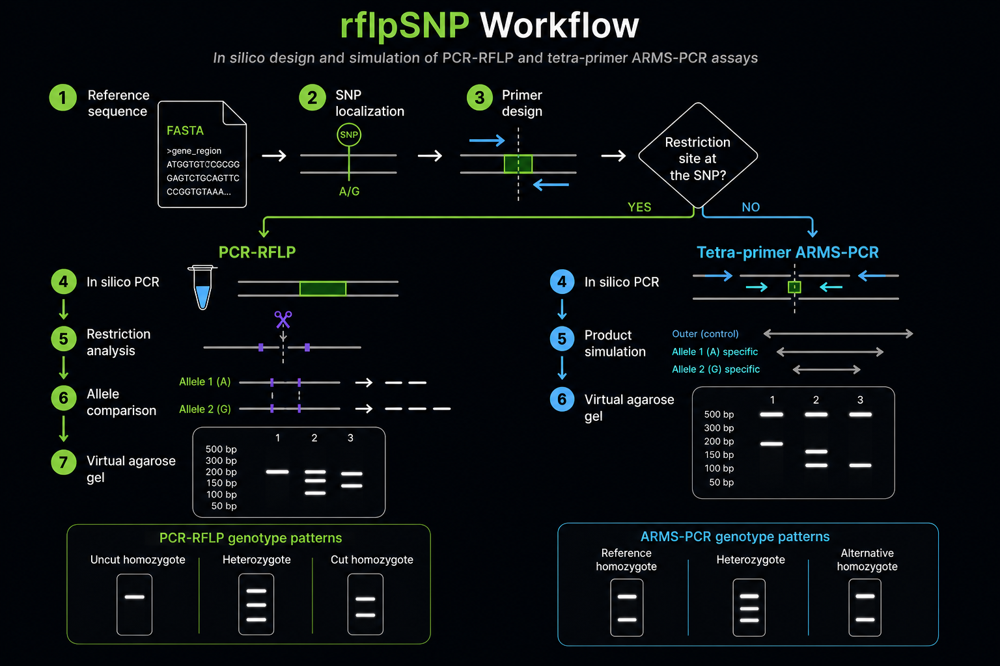

# `rflpSNP`

### In silico design and simulation of PCR-RFLP and ARMS-PCR assays for SNP genotyping

> `rflpSNP` is an R package for designing and simulating PCR-RFLP and tetra-primer ARMS-PCR assays for known-SNP genotyping. It supports a traceable workflow from a reference sequence and SNP flanking sequence through primer design, in-silico product analysis, and virtual agarose-gel prediction.

<!-- badges: start -->
[](https://github.com/Mike-EA/rflpSNP/actions/workflows/R-CMD-check.yaml)
[](https://opensource.org/licenses/MIT)
[](https://Mike-EA.github.io/rflpSNP/)
<!-- badges: end -->

---



## Overview

`rflpSNP` supports two complementary strategies for genotyping a known biallelic SNP. The workflow figure summarizes their shared preparation steps and the decision that separates them.

**PCR-RFLP** (*Restriction Fragment Length Polymorphism*) amplifies a region around the SNP and uses a restriction enzyme whose recognition site is created or abolished by one allele. The simulated digest predicts the allele-dependent fragment pattern expected after electrophoresis.

**Tetra-primer ARMS-PCR** is the alternative when no useful restriction-site change is available. It combines two outer control primers with two inner allele-specific primers. The simulated products predict a control band and diagnostic products for the reference and alternative alleles.

Both routes begin with a reference FASTA sequence and a dbSNP flanking sequence, then locate the SNP, design primers, simulate products, and visualize expected genotype patterns.

> **Important:** `rflpSNP` produces candidate designs for computational evaluation. It does not establish genomic specificity, experimental performance, or a biological genotype. Experimental validation is required; check primers with a specialized tool such as IDT OligoAnalyzer and independently verify specificity before synthesis.

---

## Features

| Capability | PCR-RFLP workflow | Tetra-primer ARMS-PCR workflow |
|---|---|---|
| Shared input preparation | Locates a known SNP in a reference FASTA with a dbSNP flanking sequence and records its coordinate and strand. | Locates the same SNP and defines the reference and alternative alleles. |
| Primer design | Generates, filters, ranks, and exports compatible forward/reverse primer pairs. | Generates, filters, ranks, and exports four-primer sets with outer control and inner allele-specific primers. |
| Candidate evaluation | Evaluates Tm, GC content, and heuristic dimer/hairpin risk; reports alternative primer pairs. | Applies the same physicochemical screening to every primer and checks the intentional inner-primer 3' mismatch pattern. |
| Product simulation | Simulates the PCR amplicon, restriction sites, alternate allele, and predicted digest fragments. | Simulates control, reference-specific, and alternative-specific products for all three genotypes. |
| Visualization | Produces amplicon and sequence maps plus a virtual agarose gel for the digest pattern. | Produces a virtual agarose gel and exports nucleotide-level maps of simulated products. |
| Reproducibility | Exports primer reports and runs the workflow with `run_pcr_rflp_pipeline()`. | Exports primer and amplicon-map reports and runs the workflow with `run_arms_pcr_pipeline()`. |

---

## Installation

### Requirements

- **R** >= 4.1
- **RStudio** is recommended, especially for users who are new to R.

`rflpSNP` uses packages from both **CRAN** and **Bioconductor**.

### Install `rflpSNP` and its dependencies

Run one of the following commands in a new R session. Both commands install
the CRAN and Bioconductor packages declared by `rflpSNP`; no separate manual
installation of `TmCalculator` or Bioconductor packages is required.

For the stable version on `main`:

```r
if (!requireNamespace("remotes", quietly = TRUE)) {
  install.packages("remotes")
}

remotes::install_github("Mike-EA/rflpSNP@main",
                        dependencies = NA,
                        upgrade = "never")
```

For the ARMS-PCR development branch before it is merged into `main`:

```r
if (!requireNamespace("remotes", quietly = TRUE)) {
  install.packages("remotes")
}

remotes::install_github("Mike-EA/rflpSNP@arms_pcr",
                        dependencies = NA,
                        upgrade = "never")
```

`dependencies = NA` installs dependencies declared in `Depends`, `Imports`
and `LinkingTo`, including the packages required by `TmCalculator`. Avoid
installing `TmCalculator` separately with `dependencies = FALSE`, because
that can leave indirect Bioconductor dependencies unavailable.

`devtools::install_github()` is equivalent, but `remotes` is used here because
it is smaller and provides the same installation engine.

### Load the package

```r
library(rflpSNP)
```

### Verify the Tm backend

`TmCalculator`'s interface has changed across versions. `rflpSNP` includes a diagnostic function:

```r
packageVersion("TmCalculator")
check_tm_backend()
```

The installation is ready when `packageVersion("TmCalculator")` reports
`1.0.8` and `check_tm_backend()` reports `[OK]`.

A successful installation should report:

```text
[OK] calc_tm() is working correctly; test Tm = ...
```

If a `[DIAGNOSTIC]` message appears, restart R and repeat the command for the
branch you are using with `force = TRUE` added to `remotes::install_github()`.

---

## Preparing the inputs

Prepare the following information before starting either workflow.

### Reference sequence

Provide a `.fa`, `.fasta`, or `.fna` file containing the target region in
5'→3' orientation. It must include sufficient sequence on both sides of the
SNP to support the requested primer-search geometry.

```text
>NC_000001.11 MTHFR gene region
ATGGTGTCTGCGGGAGTCTGCAGTTCCCGGTGTAAAATCAGGGCAGTGAC...
```

The current guide uses [NCBI Nucleotide](https://www.ncbi.nlm.nih.gov/nuccore)
as an example source. Record the accession and assembly used for reproducibility.

### dbSNP flanking sequence and alleles

Obtain a flank immediately preceding the SNP from its
[dbSNP](https://www.ncbi.nlm.nih.gov/snp/) record. `rflpSNP` uses this sequence
as an anchor to locate the SNP coordinate in the reference FASTA. For
ARMS-PCR, also provide the alternative allele explicitly; confirm that both
alleles are reported in the same orientation as the loaded FASTA.

### Restriction-enzyme motif for PCR-RFLP

PCR-RFLP additionally requires an enzyme whose recognition site overlaps the
polymorphism. Supply its recognition motif in IUPAC notation and its cleavage
offset. For example, *HinfI* uses:

```text
G^ANTC
```

Useful IUPAC codes include `N` (any base), `R` (A or G), `Y` (C or T), `W` (A
or T), and `S` (C or G). Confirm the enzyme motif and cleavage convention with
the supplier documentation before designing the assay.

---

## Quick start

The main workflow can be run step by step or through the complete pipeline.

### 1. Load the reference sequence

```r
gene_seq <- read_gene_fasta("MTHFR_completeseq.fa")
```

### 2. Locate the SNP

The SNP is located using its flanking sequence:

```r
snp <- locate_snp( gene_seq,
                  flank_seq = "GAAAAGCTGCGTGATGATGAAATCG")

snp$snp_pos
snp$snp_base
snp$strand
```

### 3. Design primers

```r
design <- design_primers(gene_seq,
                         snp_pos = snp$snp_pos)
```

The resulting object contains the best primer pairs and their relevant characteristics:

```r
design
design$top
design$best_pair
design$n_pairs_total
```

### 4. Simulate PCR

```r
bp <- design$best_pair

pcr <- simulate_pcr(gene_seq,
                    fwd_primer = bp$forward_seq,
                    rev_primer = bp$reverse_seq)
```

### 5. Find the restriction site

For the example using *HinfI*:

```r
site <- find_restriction_site(pcr,
                              enzyme_motif = "GANTC",
                              cut_offset = 1)
```

### 6. Simulate the complete PCR-RFLP workflow

Once the individual steps are understood:

```r
result <- run_pcr_rflp_pipeline(gene_seq,
                                flank_seq = "GAAAAGCTGCGTGATGATGAAATCG",
                                enzyme_motif = "GANTC",
                                cut_offset = 1)

result$snp
result$design
result$pcr_result
result$restriction_result
```

---

## Tetra-primer ARMS-PCR

Use ARMS-PCR when the SNP does not provide a useful restriction-site change.
The assay contains two outer primers (an amplification control) and two inner
primers, each specific to one allele. The inner primers end at the SNP and
carry a deliberate second mismatch near their 3' ends.

```r
arms <- run_arms_pcr_pipeline(gene_seq,
                              flank_seq = "GAAAAGCTGCGTGATGATGAAATCG",
                              alt_allele = "T",
                              export_txt = TRUE,
                              output_file = "mthfr_arms_pcr.txt")

# Inspect the recommended four-primer set and the three simulated genotypes
arms$design$best_set
arms$pcr_result$products

# Display the virtual agarose gel
arms$gel
```

The expected lanes contain the external control band plus the diagnostic band
for the matching allele: `ref/ref` has control + reference, `ref/alt` has all
three bands, and `alt/alt` has control + alternative. The report contains the
top ranked candidates, parameters and the predicted sizes.

ARMS-PCR candidates are **not experimentally validated**. Confirm genomic
specificity, secondary structures, polymerase compatibility (no 3'→5'
proofreading activity), deliberate mismatch choice and annealing conditions
before ordering oligonucleotides.

### Nucleotide-level product map

After simulating a set, export a reproducible map of every product. It records
both strands base by base, FASTA coordinates, the SNP and the participating
primers.

```r
export_arms_amplicon_map_txt(arms$pcr_result,
                             output_file = "arms_pcr_amplicon_map.txt")
```

See the complete ARMS-PCR guide in
[docs/ARMS_PCR_USER_GUIDE.md](docs/ARMS_PCR_USER_GUIDE.md).

---

## Example: MTHFR C677T

The example used throughout the current user guide is the **MTHFR C677T SNP (rs1801133)** with the restriction enzyme **HinfI**.

A successful primer-design run can produce a result similar to:

```text
=== Best primer pair selected ===

Forward: TGGTCTCTTCATCCCTCGCCTTGAA
Reverse: GTCAGCCTCAAAGAAAAGCTGCGTG

Expected amplicon: 184 bp
Estimated RFLP fragments: 146 + 38 bp
```

The selected design stores information such as:

| Output | Description |
|---|---|
| `forward_seq`, `reverse_seq` | Primer sequences, 5' → 3' |
| `forward_tm`, `reverse_tm` | Primer melting temperatures |
| `forward_gc`, `reverse_gc` | GC content |
| `amplicon_bp` | Expected amplicon size |
| `tm_diff` | Tm difference between primers |
| `heterodimer_dg` | Heuristic heterodimer risk |
| `fragment_1`, `fragment_2` | Estimated digestion fragments |
| `score` | Internal ranking index |
| `recommended` | Identifies the recommended pair |

---

## Visualization

`rflpSNP` returns `ggplot` objects for virtual gels and maps suitable for
inspection or saving with `ggplot2::ggsave()`. The available visualization
depends on the selected assay type.

### PCR-RFLP visualization

Use the simulated amplicon and restriction-site result to display primer
placement, the candidate cut site, and predicted digestion products.

```r
map <- plot_amplicon_map(pcr,
                         bp$forward_seq,
                         bp$reverse_seq,
                         site,
                         enzyme_name = "HinfI")
```

For a nucleotide-level PCR-RFLP view:

```r
plot_sequence_map(pcr,
                  site,
                  enzyme_name = "HinfI")
```

Render the expected PCR-RFLP genotype patterns:

```r
simulate_gel(amplicon_size = pcr$size,
             fragment_sizes = c(146, 38),
             genotype_labels = c("Homozygous C/C",
                                 "Heterozygous C/T",
                                 "Homozygous T/T"))
```

### Tetra-primer ARMS-PCR visualization

The ARMS-PCR simulator produces all control and allele-specific products for
the three genotypes. Pass that result directly to the ARMS gel simulator:

```r
arms_gel <- simulate_arms_gel(arms$pcr_result)
arms_gel
```

For a reproducible, nucleotide-level representation of each ARMS-PCR product,
export its coordinates, strands, SNP, and participating primers:

```r
export_arms_amplicon_map_txt(arms$pcr_result, output_file = "arms_pcr_amplicon_map.txt")
```

---

## Primer-design parameters

The two design functions use different acceptance criteria. Tune one group at
a time, retain the reported `parameters` object, and confirm any selected set
with independent specificity and thermodynamic checks.

### PCR-RFLP: `design_primers()`

| Parameter group | Parameters (defaults) | Purpose for a clean PCR-RFLP design |
|---|---|---|
| Search geometry | `upstream = 160`, `downstream = 200`, `min_distance_to_snp = 20` | Defines the sequence available to each primer and keeps primer-binding sites away from the SNP. Expand an asymmetric window when the local sequence is constrained. |
| Individual primers | `length_min = 18`, `length_max = 24`; `tm_min = 50`, `tm_max = 65`; `gc_min = 35`, `gc_max = 65` | Retains primers with practical length, melting-temperature, and GC-content ranges. |
| Pair compatibility | `tm_diff_max = 5` | Limits the difference between forward and reverse primer Tm. A smaller value can improve annealing compatibility but narrows the search. |
| Amplicon and digest | `amplicon_min = 150`, `amplicon_max = 300`; `min_fragment_diff = 25`; `max_small_fragment = 100`; `min_fragment_size = 40` | Favors a practical amplicon and digestion fragments that can be distinguished on an agarose gel. Verify the actual enzyme cut after simulation. |
| Search breadth | `max_candidates_per_strand = 40`, `n_top = 5`, `verbose = TRUE` | Controls how many filtered candidates are paired and how many alternatives are returned. Increase the candidate cap before relaxing biochemical limits. |
| Tm chemistry | `Na = 100`, `Mg = 2`, `dNTPs = 0.2`, `oligo_conc_nM = 500` | Sets the conditions used for Tm calculations; match them to the intended PCR mixture. |

### Tetra-primer ARMS-PCR: `design_arms_primers()`

| Parameter group | Parameters (defaults) | Purpose for a clean ARMS-PCR design |
|---|---|---|
| Four-primer geometry | `outer_flank = 160`; outer and inner lengths `18`–`24`; `mismatch_positions = c(2, 3)` | Defines outer control primers and allele-specific inner primers. The deliberate mismatch positions govern the additional 3' discrimination required by ARMS-PCR. |
| Individual-primer chemistry | `tm_min = 50`, `tm_max = 65`; `gc_min = 35`, `gc_max = 65`; `dimer_dg_min = -6`, `hairpin_dg_min = -6` | Filters every outer and inner primer by Tm, GC content, and heuristic self-structure risk. |
| Four-primer compatibility | `heterodimer_dg_min = -6` | Rejects sets with an unfavorable heuristic cross-dimer score among any pair of the four primers. |
| Product and gel separation | `control_amplicon_min = 150`, `control_amplicon_max = 500`; `allele_amplicon_min = 80`, `allele_amplicon_max = 400`; `min_band_diff = 25` | Requires a control product, two diagnostic products, and enough separation between all predicted bands for interpretation. |
| Search breadth | `max_candidates_per_pool = 20`, `max_raw_candidates_per_pool = Inf`, `n_top = 5` | Bounds combinatorial search time. Broaden candidate pools before relaxing specificity or product-separation criteria. |
| Tm chemistry | `Na = 100`, `Mg = 2`, `dNTPs = 0.2`, `oligo_conc_nM = 500` | Uses the same chemistry assumptions as PCR-RFLP; change them when the planned reaction mixture differs. |

See the [assay-specific parameter guide](docs/PARAMETER_TUNING_AND_WORKED_EXAMPLES.md)
for reproducible MTHFR PCR-RFLP and FTO ARMS-PCR examples using non-default
settings.

---

## Validation before going to the lab

Computational design is only one part of assay development.

Before ordering primers:

1. **Verify primer performance with a specialized tool**, such as IDT OligoAnalyzer. The Tm, dimer, and hairpin calculations in `rflpSNP` are intended as fast heuristics for comparing candidates.
2. **Confirm primer specificity**, for example with a BLAST search against the relevant genome or transcriptome.
3. **Verify the restriction enzyme recognition site and cleavage position** against the supplier's technical documentation.
4. Experimentally validate the final assay before using it for genotyping.

If `simulate_pcr()` reports multiple potential binding sites, primer specificity should receive particular attention.

For the complete scope, computational assumptions, experimental checklist and
responsible-use statement, see
[docs/LIMITATIONS_AND_VALIDATION.md](docs/LIMITATIONS_AND_VALIDATION.md).

---

## Documentation

The README is a quick entry point. The extended documentation supports
experimental planning, reproducible analysis and interpretation for both
teaching and research use:

| Resource | Use it for |
|---|---|
| [Documentation index](docs/README.md) | Choose a route through the guides |
| [Experimental design guide](docs/EXPERIMENTAL_DESIGN_GUIDE.md) | Select a strategy, prepare inputs and plan controls |
| [PCR-RFLP user guide](docs/PCR_RFLP_USER_GUIDE.md) | Run and review the PCR-RFLP workflow step by step |
| [ARMS-PCR user guide](docs/ARMS_PCR_USER_GUIDE.md) | Design and simulate tetra-primer ARMS-PCR assays |
| [Limitations and validation](docs/LIMITATIONS_AND_VALIDATION.md) | Separate in-silico predictions from experimental evidence |
| [Troubleshooting guide](docs/TROUBLESHOOTING_GUIDE.md) | Investigate ambiguous inputs and results |

---

## Glossary

- **SNP** — *Single Nucleotide Polymorphism*: a genomic position where different alleles can occur.
- **Primer** — short oligonucleotide that provides the starting point for DNA amplification during PCR.
- **Tm** — melting temperature of a primer.
- **%GC** — percentage of G and C bases in a primer.
- **Amplicon** — DNA fragment produced by PCR.
- **Dimer** — unwanted interaction between primer molecules.
- **Hairpin** — secondary structure formed when a primer folds back on itself.
- **Restriction enzyme** — enzyme that recognizes and cuts a specific DNA sequence.
- **RFLP** — *Restriction Fragment Length Polymorphism*, a difference in restriction-fragment sizes caused by sequence variation.

---

## Development

The package is under active development.

The main branch is intended to contain the stable version of the project, while new functionality can be developed in feature branches.

For bugs, improvements, or feature requests, please use the repository's GitHub Issues.

---

## License

> Copyright (c) 2026 rflpSNP authors

Permission is hereby granted, free of charge, to any person obtaining a copy
of this software and associated documentation files (the "Software"), to deal
in the Software without restriction, including without limitation the rights
to use, copy, modify, merge, publish, distribute, sublicense, and/or sell
copies of the Software, and to permit persons to whom the Software is
furnished to do so, subject to the following conditions:

The above copyright notice and this permission notice shall be included in all
copies or substantial portions of the Software.

THE SOFTWARE IS PROVIDED "AS IS", WITHOUT WARRANTY OF ANY KIND, EXPRESS OR
IMPLIED, INCLUDING BUT NOT LIMITED TO THE WARRANTIES OF MERCHANTABILITY,
FITNESS FOR A PARTICULAR PURPOSE AND NONINFRINGEMENT. IN NO EVENT SHALL THE
AUTHORS OR COPYRIGHT HOLDERS BE LIABLE FOR ANY CLAIM, DAMAGES OR OTHER
LIABILITY, WHETHER IN AN ACTION OF CONTRACT, TORT OR OTHERWISE, ARISING FROM,
OUT OF OR IN CONNECTION WITH THE SOFTWARE OR THE USE OR OTHER DEALINGS IN THE
SOFTWARE.

---

## Citation

> cff-version: 1.2.0

If you use this software, please cite it as below.

Esparza Armenta, M. (2026). rflpSNP: An open-source R pipeline for RFLP primer design and in silico gel simulation (Version 0.1.0) [Computer software]. https://github.com/Mike-EA/rflpSNP

---

## Author

**Mike-EA**

---

### Project status

`rflpSNP` is being developed as a tool for the **in-silico design, evaluation, and simulation of PCR-RFLP and tetra-primer ARMS-PCR assays for SNP genotyping**.

Experimental validation remains an essential part of the workflow.
