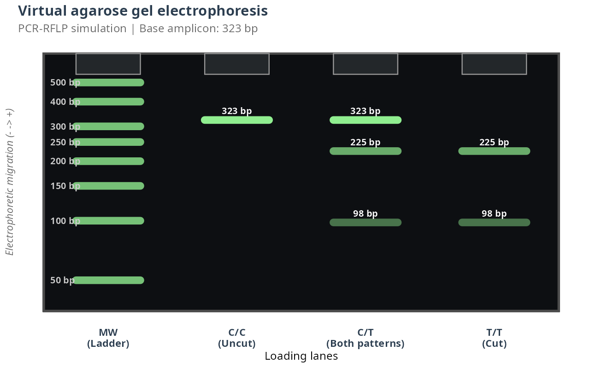
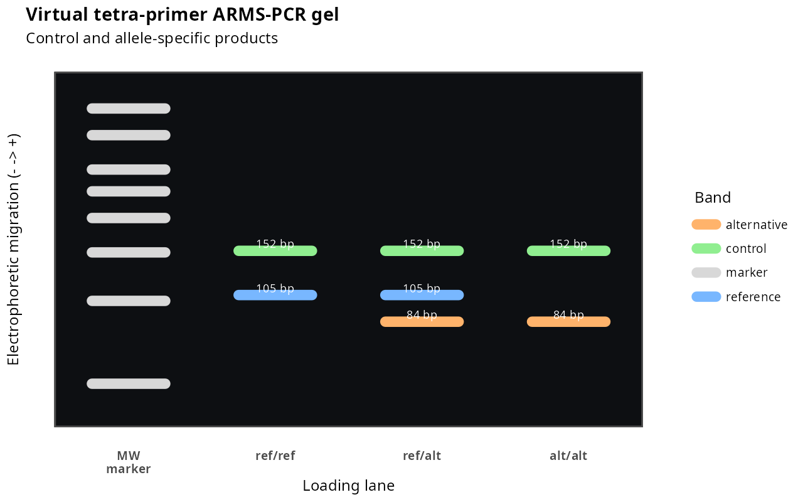

# Assay-Specific Primer-Design Parameters and Reproducible Examples

Use parameters to explore a design space, not to convert a weak candidate into
an experimentally valid assay. Record every non-default setting with the FASTA,
assembly, alleles, package version, and exported report.

The two primer-design functions are intentionally different. PCR-RFLP designs
one primer pair and prioritizes a digest with resolvable fragments. Tetra-primer
ARMS-PCR designs four interacting primers and prioritizes allele discrimination,
a control product, and separation among three PCR products. Do not transfer
fragment constraints from PCR-RFLP to ARMS-PCR, or deliberate-mismatch and
four-primer constraints from ARMS-PCR to PCR-RFLP.

## Parameters Shared by Both Workflows

| Function or stage | Parameters | Use |
|---|---|---|
| Reference and SNP localization | `seq_index`, `flank_seq`, `snp_offset` | Choose a documented reference sequence and locate the SNP. Prefer a longer unique flank before changing `snp_offset`. |
| Tm calculation | `Na`, `Mg`, `dNTPs`, `oligo_conc_nM` | Match the intended PCR chemistry. These settings affect the Tm filters in both design functions. |
| Tm diagnostics | `nn_table`, `salt_corr_method`, `profiles` in `calc_tm()` or `compare_tm_conditions()` | Compare calculations under explicitly stated assumptions; they do not establish in vitro performance. |
| Candidate review | `evaluate_dimer()`, `evaluate_hairpin()` | Use heuristic scores to prioritize candidates, then confirm selected primers with specialized software. |

## PCR-RFLP Parameters: `design_primers()`

PCR-RFLP uses a forward/reverse primer pair. Its design settings must balance
primer quality, amplicon geometry, and the visibility of the two restriction
fragments generated from the cut allele.

| Parameter group | Parameters and defaults | Design role |
|---|---|---|
| Search geometry | `upstream = 160`, `downstream = 200`, `min_distance_to_snp = 20` | Defines the available sequence around the SNP and keeps primer sites away from it. Expand an asymmetric window if one flank has poor composition. |
| Individual primer filters | `length_min = 18`, `length_max = 24`; `tm_min = 50`, `tm_max = 65`; `gc_min = 35`, `gc_max = 65` | Retains primers with practical length, Tm, and GC content. Relax one criterion at a time and retain the reason in the report. |
| Pair compatibility | `tm_diff_max = 5` | Limits the forward/reverse Tm difference. A smaller value can improve compatibility, but reduces the candidate pool. |
| Amplicon size | `amplicon_min = 150`, `amplicon_max = 300` | Selects a product appropriate for amplification and the intended agarose-gel range. |
| Digest resolution | `min_fragment_diff = 25`, `max_small_fragment = 100`, `min_fragment_size = 40` | Filters pairs using an SNP-coordinate approximation. Confirm the actual enzyme cut and fragment sizes on the simulated amplicon before synthesis. |
| Search breadth | `max_candidates_per_strand = 40`, `n_top = 5`, `verbose = TRUE` | Controls exploration time and the number of alternatives retained. Increase the candidate cap before relaxing biochemical thresholds. |

### PCR-RFLP Simulation and Visualization Parameters

| Function | Parameters | Use |
|---|---|---|
| `simulate_pcr()` | `max_mismatch` | Counts approximate primer-binding sites in the supplied FASTA. It is not a genome-wide specificity search. |
| `find_restriction_site()` | `enzyme_motif`, `cut_offset` | Defines the IUPAC recognition motif and the cleavage coordinate. Confirm both against the enzyme supplier documentation. |
| `simulate_gel()` | `amplicon_size`, `fragment_sizes`, `ladder_sizes`, `genotype_labels` | Creates an idealized PCR-RFLP gel; it does not model incomplete digestion, staining, or electrophoresis conditions. |

## Tetra-primer ARMS-PCR Parameters: `design_arms_primers()`

ARMS-PCR designs two outer primers and two allele-specific inner primers. Its
settings must preserve terminal SNP specificity, the deliberate second mismatch,
and readable separation among the control, reference-specific, and
alternative-specific products.

| Parameter group | Parameters and defaults | Design role |
|---|---|---|
| Four-primer geometry | `outer_flank = 160`; `outer_length_min = 18`, `outer_length_max = 24`; `inner_length_min = 18`, `inner_length_max = 24` | Defines the available outer-control and inner allele-specific primers. Narrowing lengths may improve uniformity but can remove valid geometries. |
| Allele discrimination | `mismatch_positions = c(2, 3)` | Specifies the deliberate mismatch positions counted from the 3' end of each inner primer. This is ARMS-PCR-specific and requires laboratory optimization. |
| Individual primer filters | `tm_min = 50`, `tm_max = 65`; `gc_min = 35`, `gc_max = 65`; `dimer_dg_min = -6`, `hairpin_dg_min = -6` | Screens every primer for physicochemical properties and heuristic self-structure risk. |
| Four-primer compatibility | `heterodimer_dg_min = -6` | Filters complete sets for heuristic cross-dimer risk among all primer pairs. |
| Product geometry | `control_amplicon_min = 150`, `control_amplicon_max = 500`; `allele_amplicon_min = 80`, `allele_amplicon_max = 400` | Requires a control product and diagnostic products within a readable range. |
| Gel resolution | `min_band_diff = 25` | Requires pairwise separation among the control, reference, and alternative products. Increase it when the gel system cannot resolve closely spaced bands. |
| Search breadth | `max_candidates_per_pool = 20`, `max_raw_candidates_per_pool = Inf`, `n_top = 5` | Bounds combinatorial search time. Broaden pools before weakening allele-discrimination or product-separation rules. |

### ARMS-PCR Simulation and Visualization Parameters

| Function | Parameters | Use |
|---|---|---|
| `simulate_arms_pcr()` | `primer_set`, `snp_pos`, `ref_allele`, `alt_allele` | Validates the four-primer geometry and predicts control and allele-specific products for all three genotypes. |
| `simulate_arms_gel()` | `ladder_sizes` | Creates an idealized gel with marker, `ref/ref`, `ref/alt`, and `alt/alt` lanes. |
| `export_arms_amplicon_map_txt()` | `output_file`, `line_width` | Records product sequences, coordinates, SNP position, and primers for reproducible review. |

## MTHFR C677T PCR-RFLP example

The documented MTHFR assay has a 323 bp amplicon and HinfI fragments of 225 and
98 bp. These values favour bands that can be resolved with an appropriate gel.

The following reproducible workflow uses the bundled GRCh38 record, selects a
323 bp amplicon, and verifies the actual HinfI cut after modelling the C→T
allelic change:

```r
library(rflpSNP)

# The file contains two assemblies. Select the documented GRCh38 record.
reference <- read_gene_fasta(system.file("extdata",
                                         "MTHFR_complete.fna",
                                         package = "rflpSNP"), seq_index = 1)

snp <- locate_snp(reference, "GAAAAGCTGCGTGATGATGAAATCG")
stopifnot(snp$snp_pos == 9644L, snp$snp_base == "C")

# A 300--400 bp product and strict fragment constraints favour gel-resolvable
# products. A cap of 100 candidates per strand keeps the final search broad.
design <- design_primers(reference,
                         snp_pos = snp$snp_pos,
                         upstream = 140L,
                         downstream = 300L,
                         min_distance_to_snp = 20L,
                         length_min = 18L,
                         length_max = 20L,
                         tm_min = 50, tm_max = 65,
                         gc_min = 35, gc_max = 65,
                         tm_diff_max = 4,
                         amplicon_min = 300L, amplicon_max = 400L,
                         min_fragment_size = 80L, max_small_fragment = 140L,
                         min_fragment_diff = 100L, max_candidates_per_strand = 100L,
                         n_top = 10L,
                         Na = 100, Mg = 2,
                         dNTPs = 0.2, oligo_conc_nM = 500,
                         verbose = TRUE)

best_pair <- design$best_pair
pcr <- simulate_pcr(reference,
                    best_pair$forward_seq,
                    best_pair$reverse_seq)

stopifnot(pcr$size == best_pair$amplicon_bp)

# Construct the alternate T allele only at the SNP and find the real cut.
snp_in_amplicon <- snp$snp_pos - pcr$start + 1L
alternate_amplicon <- pcr$amplicon
Biostrings::subseq(alternate_amplicon, snp_in_amplicon, snp_in_amplicon) <-
  Biostrings::DNAString("T")

reference_site <- find_restriction_site(pcr, "GANTC", cut_offset = 1)
alternate_site <- find_restriction_site(alternate_amplicon, "GANTC", 1)
stopifnot(reference_site$n_sites == 0L, alternate_site$n_sites == 1L)

cut_position <- alternate_site$sites$cut_pos[1]
fragments <- sort(c(cut_position, pcr$size - cut_position), decreasing = TRUE)
stopifnot(identical(fragments, c(225, 98)))

gel <- simulate_gel(pcr$size,
                    fragments,
                    genotype_labels = c("C/C", "C/T", "T/T"))
gel
```



The recommended pair is `TGACTGTCATCCCTATTG` / `GAAGAACTCAGCGAACTC`. The
heterozygote has 323, 225, and 98 bp bands. This is an output from
`simulate_gel()`, not an experimental gel. Confirm enzyme conditions and
primer specificity before synthesis.

### Export and review the MTHFR design record

Export the design immediately after candidate selection. This preserves the
recommended pair and the ranked alternatives in a portable TXT report, so the
computational choice can be reviewed alongside the laboratory assay record.

```r
mthfr_report <- export_primers_txt(
  design,
  output_file = "mthfr_c677t_pcr_rflp_primer_report.txt"
)

# `mthfr_report` is the path of the file just written.
mthfr_report
```

For this PCR-RFLP example, review the recommended forward and reverse primer
sequences (always reported 5'→3'), their Tm and GC values, the 323 bp amplicon,
and the candidate ranking. The fragment sizes in this report are an
SNP-coordinate estimate used during ranking; retain the separate simulated
HinfI result above (225 and 98 bp for the alternate allele) as the exact
in-silico cut verification. Archive both results with the FASTA accession and
assembly, flank sequence, alleles/orientation, enzyme and cut convention, and
the package version used for the run.

## FTO rs8050136 tetra-primer ARMS-PCR example

The bundled FTO regression case uses a 171 bp reference window, SNP coordinate
86, C reference allele, A alternate allele, 20 bp outer primers, 18--20 bp
inner primers, Tm 55--72 °C, and a minimum 20 bp band difference. Its expected
products are 152 bp control, 105 bp reference, and 84 bp alternate.

The following complete code generated the figure. It uses the fixed reference
window and all exploratory parameters from the regression case:

```r
library(rflpSNP)

# Load the bundled full FTO reference and locate rs8050136 reproducibly.
reference <- read_gene_fasta(system.file("extdata",
                                         "FTO_complete.fa",
                                         package = "rflpSNP"))

snp <- locate_snp(reference, "CATGCCAGTTGCCCACTGTGGCAAT")
stopifnot(snp$snp_pos == 78401L, snp$snp_base == "C")

# Tight product ranges and a 20 bp minimum difference make the three bands
# readable; capped pools keep this example quick to reproduce.
design <- design_arms_primers(reference,
                              snp_pos = snp$snp_pos,
                              ref_allele = snp$snp_base,
                              alt_allele = "A",
                              outer_flank = 85L,
                              outer_length_min = 20L,
                              outer_length_max = 20L,
                              inner_length_min = 18L,
                              inner_length_max = 20L,
                              tm_min = 55, tm_max = 72,
                              gc_min = 35, gc_max = 65,
                              dimer_dg_min = -8,
                              hairpin_dg_min = -6,
                              heterodimer_dg_min = -9,
                              control_amplicon_min = 150L,
                              control_amplicon_max = 200L,
                              allele_amplicon_min = 80L,
                              allele_amplicon_max = 150L,
                              min_band_diff = 20L,
                              max_candidates_per_pool = 8L,
                              max_raw_candidates_per_pool = 8L)

# Confirm the three predicted genotypes and render the virtual gel.
pcr_result <- simulate_arms_pcr(reference,
                                design$best_set,
                                snp_pos = snp$snp_pos,
                                ref_allele = snp$snp_base,
                                alt_allele = "A")

pcr_result$products
simulate_arms_gel(pcr_result)
```



The heterozygote shows all three bands. The regression thresholds are an
exploratory example and require independent review before experimental use.

### Export and review the FTO design record

The ARMS-PCR design report captures the recommended four-primer set, the
ranked alternatives, expected `ref/ref`, `ref/alt`, and `alt/alt` bands, and
the parameter values used to generate the design.

```r
fto_report <- export_arms_primers_txt(
  design,
  output_file = "fto_rs8050136_arms_pcr_primer_report.txt"
)

# Optional companion file: a nucleotide-level map of every simulated product.
fto_product_map <- export_arms_amplicon_map_txt(
  pcr_result,
  output_file = "fto_rs8050136_arms_pcr_product_map.txt"
)

fto_report
fto_product_map
```

Use the design report to review all four sequences (5'→3'), primer positions,
the deliberate inner-primer mismatches, and the predicted 152, 105, and 84 bp
products before ordering. The companion map is useful for a laboratory record
because it preserves the nucleotide sequence, FASTA coordinates, SNP position,
and participating primers for each simulated product. Keep both TXT files with
the reference accession/assembly, allele orientation, reaction conditions, and
independent specificity and oligonucleotide-quality checks; neither report
replaces experimental optimization or validation.
